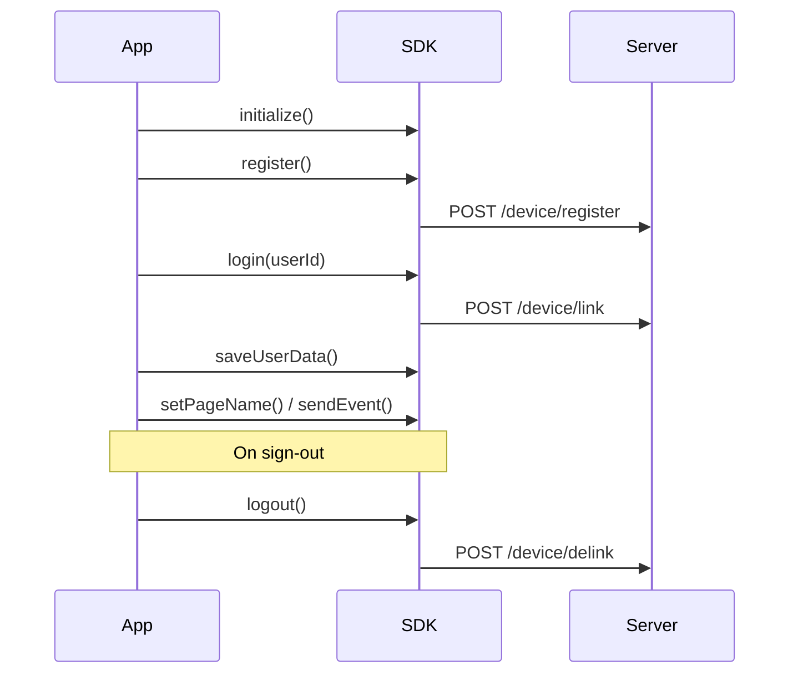

# PushApp SDK — Integration Guide

Step-by-step integration manual for **PushApp Ionic/Capacitor SDK** — push notifications, in-app messaging, and event tracking.

**Navigation hub:** [README.md](../README.md) (when to call what, API summary, troubleshooting index)

**Canonical code:** `example-app/` — copy `pushapp-setup.ts` first

**Supported platforms:** Android and iOS (Ionic / Angular / Capacitor). Not supported in the browser.

---

## 1. Before you start

### What you need from PushApp

| Item | Description |
|------|-------------|
| **App ID** | Your channel id, e.g. `yourtenant_1234567890`. The part before the first `_` is your tenant name. |
| **Environment** | Production (`sandbox: false` → `{tenant}.pushapp.ai`) or sandbox (`sandbox: true` → `{tenant}.pushapp.co.in`). |
| **Firebase project** | You configure Firebase in your own app; PushApp uses it for push delivery. |

### Your app requirements

- Ionic + Capacitor project (Capacitor 7+ required)
- Node.js 18+
- Android Studio (Android) and/or Xcode (iOS)
- Firebase project with Android and/or iOS apps configured
- **Real device** for push testing (emulators are unreliable for FCM/APNs)

### Store config in `environment.ts`

```typescript
// src/environments/environment.ts
export const environment = {
  production: false,
  pushApp: {
    appId: 'yourtenant_1234567890',
    sandbox: true,
    debugMode: true, // dev only
  },
};
```

---

## 2. Install the SDK

```bash
npm install pushapp-ionic @capacitor/push-notifications
npx cap sync
```

For iOS:

```bash
cd ios/App && pod install
```

> `@capacitor/push-notifications` is a **peer dependency**. The example app uses the SDK's native token caching + retry pattern instead — see [§5B](#5b--register-patterns-pick-one).

---

## 3. Firebase setup

### Android

1. In [Firebase Console](https://console.firebase.google.com), add an Android app with your **package name** (must match `applicationId` in `android/app/build.gradle`).
2. Download `google-services.json`.
3. Place it at: `android/app/google-services.json`
4. Complete [§3b Android Gradle](#3b-android-gradle-required) — the JSON file alone is not enough.
5. Rebuild: `npx cap sync android`

### iOS

1. In Firebase Console, add an iOS app with your bundle id.
2. Download `GoogleService-Info.plist`.
3. Add it to your Xcode app target (`ios/App/App/`).
4. In Xcode, enable **Push Notifications** capability for your app target.

### 3b. Android Gradle (required)

`google-services.json` alone does **not** enable FCM. You must apply the Google Services Gradle plugin.

**1. Project-level** `android/build.gradle` — add the classpath:

```gradle
buildscript {
    dependencies {
        classpath 'com.google.gms:google-services:4.4.2'
    }
}
```

**2. App-level** `android/app/build.gradle` — apply the plugin when the file exists:

```gradle
try {
    def servicesJSON = file('google-services.json')
    if (servicesJSON.text) {
        apply plugin: 'com.google.gms.google-services'
    }
} catch(Exception e) {
    logger.info("google-services.json not found, google-services plugin not applied.")
}
```

**3. Rebuild:**

```bash
npx cap sync android
```

Reference: `example-app/android/build.gradle` and `example-app/android/app/build.gradle`.

**4. Optional but recommended** — in `android/app/src/main/AndroidManifest.xml` inside `<application>`:

```xml
<meta-data
    android:name="com.google.firebase.messaging.default_notification_icon"
    android:resource="@mipmap/ic_launcher" />
<meta-data
    android:name="com.google.firebase.messaging.default_notification_channel_id"
    android:value="pushapp_channel_id" />
```

---

## 4. iOS native setup

Update `ios/App/App/AppDelegate.swift` so push notifications work and the SDK receives the APNs token.

```swift
import UserNotifications
import PushappIonic

// AppDelegate must conform to UNUserNotificationCenterDelegate
class AppDelegate: UIResponder, UIApplicationDelegate, UNUserNotificationCenterDelegate {

    func application(_ application: UIApplication,
                     didFinishLaunchingWithOptions launchOptions: [UIApplication.LaunchOptionsKey: Any]?) -> Bool {
        UNUserNotificationCenter.current().delegate = self
        return true
    }

    func application(_ application: UIApplication,
                     didRegisterForRemoteNotificationsWithDeviceToken deviceToken: Data) {
        if #available(iOS 15.2, *) {
            PushApp.shared.handleDeviceToken(deviceToken)
        }
    }

    // Show notifications when app is in foreground
    func userNotificationCenter(_ center: UNUserNotificationCenter,
                                willPresent notification: UNNotification,
                                withCompletionHandler completionHandler: @escaping (UNNotificationPresentationOptions) -> Void) {
        if #available(iOS 14.0, *) {
            completionHandler([.banner, .sound, .badge])
        } else {
            completionHandler([.alert, .sound, .badge])
        }
    }
}
```

**Minimum iOS version for the SDK:** 15.2

### 4b. iOS notification open / CTA tracking

When the user **taps** a push notification, call the SDK so campaigns are tracked. Without this, `trackPushNotificationEvent` never fires.

Add to `AppDelegate.swift`:

```swift
func userNotificationCenter(_ center: UNUserNotificationCenter,
                            didReceive response: UNNotificationResponse,
                            withCompletionHandler completionHandler: @escaping () -> Void) {
    let userInfo = response.notification.request.content.userInfo
    let actionId = response.actionIdentifier

    guard let token = userInfo["click_token"] as? String else {
        completionHandler()
        return
    }

    var event = "opened"
    var ctaId: String? = nil

    // Handle CTA button taps
    if let buttons = userInfo["buttons"] as? [[String: Any]],
       let matchingButton = buttons.first(where: { $0["id"] as? String == actionId }) {
        event = "cta"
        ctaId = matchingButton["id"] as? String
        if let urlString = matchingButton["url"] as? String,
           let url = URL(string: urlString) {
            UIApplication.shared.open(url)
        }
    }

    if #available(iOS 15.2, *) {
        PushApp.shared.trackPushNotificationEvent(token: token, event: event, ctaId: ctaId) { _ in }
    }
    completionHandler()
}
```

Full working example: `example-app/ios/App/App/AppDelegate.swift`

> **Android:** notification tap tracking is handled by the SDK's `NotificationClickReceiver` — no extra app code required.

---

## 5. SDK integration (required)

### Call order

Always call SDK methods in this order:

```
initialize()  →  register()  →  login()
```

If the order is wrong, the SDK logs an error and rejects the promise. The app will not crash.

### File placement (Ionic Angular)

| SDK call | Suggested file | Lifecycle hook |
|----------|----------------|----------------|
| `initialize` + `register` | `app.component.ts` or `pushapp-setup.ts` | `ngOnInit` |
| `login` + `saveUserData` | `login.page.ts` | After auth success |
| `logout` | Logout handler / `home.page.ts` | User taps sign out |
| `setPageName` / `sendEvent` | Each page `.ts` | `ionViewDidEnter` |
| `registerPlaceholder` | Page with DOM slot | `ionViewDidEnter` / `ionViewWillLeave` |
| `registerTooltipTarget` | Page with anchor element | `ionViewDidEnter` / `ionViewWillLeave` |
| `AppDelegate` changes | `ios/App/App/AppDelegate.swift` | Native — one-time setup |

---

### Flow A — App launch (every cold start)

Call **`initialize()`** and **`register()`** as early as possible — on the login screen or in `app.component.ts` — **before** the user signs in.

```typescript
// pushapp-setup.ts (recommended — copy from example-app)
import { Capacitor } from '@capacitor/core';
import { PushApp } from 'pushapp-ionic';
import { environment } from '../environments/environment';

export async function setupPushAppOnLaunch(): Promise<void> {
  if (!Capacitor.isNativePlatform()) return;

  await PushApp.initialize({
    appId: environment.pushApp.appId,
    sandbox: environment.pushApp.sandbox,
    debugMode: !environment.production && environment.pushApp.debugMode,
  });

  await registerDevice(); // see §5B
}
```

```typescript
// app.component.ts or login.page.ts — ngOnInit
import { setupPushAppOnLaunch } from './pushapp-setup';

await setupPushAppOnLaunch();
```

---

### Flow B — After user authenticates

Call **`login()`** and **`saveUserData()`** in your login success handler — not at app startup.

```typescript
// login.page.ts — on successful auth
import { PushApp } from 'pushapp-ionic';

const res = await PushApp.login({ userId: this.username });

const headers = await PushApp.getDeviceHeaders();
const deviceId = headers['X-Device-ID'] ?? '';
const code = `${this.username}_${deviceId}`;

await PushApp.saveUserData({
  code,
  additionalInfo: { /* your fields */ },
  cohorts: { /* your segments */ },
});
```

---

### Flow C — Returning user (session restore)

If the user is already logged in (e.g. token in `localStorage`), run the launch flow **and** call `login()` again with the stored user id.

```typescript
// app.component.ts — ngOnInit
const userId = localStorage.getItem('username');
if (userId) {
  await setupPushAppOnLaunch();
  await PushApp.login({ userId });
  navigateToHome();
} else {
  navigateToLogin();
}
```

On the login page, still call `setupPushAppOnLaunch()` so `initialize` + `register` run before the user signs in.

---

### Step A — Initialize

```typescript
await PushApp.initialize({
  appId: environment.pushApp.appId,
  sandbox: environment.pushApp.sandbox,
  debugMode: environment.pushApp.debugMode, // optional — verbose logs in debug builds
  // slackWebhookUrl: '...'  // dev/integration only — never in production
});
```

### 5B — Register patterns (pick one)

| Pattern | When to use | Code |
|---------|-------------|------|
| **A — Native cached token (recommended)** | Ionic apps using this SDK | `PushApp.register({ fcmToken: '' })` with retry — see `example-app/src/app/pushapp-setup.ts` |
| **B — Capacitor listener** | When you already use `@capacitor/push-notifications` listeners | Listener passes `token.value` to `register()` |

#### Pattern A (recommended) — `pushapp-setup.ts`

The native SDK caches the FCM/APNs token. On Android, the first launch may not have a token yet — retry until it arrives:

```typescript
const REGISTER_RETRY_MS = 1000;
const REGISTER_MAX_ATTEMPTS = 8;

export async function registerDevice(fcmToken?: string): Promise<void> {
  for (let attempt = 1; attempt <= REGISTER_MAX_ATTEMPTS; attempt++) {
    try {
      await PushApp.register({ fcmToken: fcmToken ?? '' });
      return;
    } catch (err) {
      if (attempt < REGISTER_MAX_ATTEMPTS) {
        await new Promise((r) => setTimeout(r, REGISTER_RETRY_MS));
      } else {
        throw err;
      }
    }
  }
}
```

`register()` is safe on every app open — the SDK **skips the network call** when already registered with the same token.

#### Pattern B — Capacitor Push Notifications

```typescript
import { PushNotifications } from '@capacitor/push-notifications';

await PushNotifications.requestPermissions();
await PushNotifications.register();

PushNotifications.addListener('registration', async (token) => {
  await PushApp.register({ fcmToken: token.value });
});
```

#### iOS note

With Pattern A, `AppDelegate` **must** call `PushApp.shared.handleDeviceToken(deviceToken)`. You do **not** need to pass `apnsToken` from JavaScript if native forwarding is set up.

With Pattern B, pass the hex APNs token from your listener:

```typescript
await PushApp.register({ apnsToken: apnsTokenHex, fcmToken: fcmTokenOptional });
```

### Step C — Login (after user signs in)

```typescript
await PushApp.login({ userId: 'USER_ID' });
```

Use your own user id (email, internal id, etc.) — the same id you use in your backend.

### Step D — Logout (on sign-out)

```typescript
try {
  await PushApp.logout(); // clears local session + server delink
} catch (err) {
  // LOGOUT_FAILED — local session is still cleared
  console.warn('PushApp.logout:', err);
}
clearLocalAuthState();
navigateToLogin();
```

Call **`logout()` before** wiping local storage. If server delink fails, local session is still cleared (`LOGOUT_FAILED` may be returned).

Example: `example-app/src/app/home/home.page.ts` → `logout()` method.

---

## 6. Customer profile (recommended after login)

Send user profile and segmentation data after login:

```typescript
const headers = await PushApp.getDeviceHeaders();
const deviceId = headers['X-Device-ID'] ?? '';
const code = `${userId}_${deviceId}`;

await PushApp.saveUserData({
  code,
  additionalInfo: {
    city: 'Mumbai',
    plan: 'premium',
  },
  cohorts: {
    segment: 'active_user',
  },
});
```

Profiles are **not** updated automatically on app open — call `saveUserData()` explicitly after login.

---

## 7. Event and page tracking

### Track page views

Call when the user navigates to a screen (`ionViewDidEnter`):

```typescript
await PushApp.setPageName({ pageName: 'home' });
```

### Track custom events

```typescript
await PushApp.sendEvent({
  eventName: 'button_clicked',
  eventData: {
    source: 'checkout',
    method: 'card',
  },
});
```

---

## 8. Optional — In-app message placements

Use these only if PushApp campaigns include **inline** or **tooltip** messages.

### Inline placeholder

The SDK **automatically tracks** placeholder position on scroll, resize, and fixed headers. Your app only registers and unregisters.

1. Add a container in your HTML — the element `id` must match `placeholderId`:

```html
<div id="promo-banner" class="promo-slot"></div>
```

2. Register when the view loads; unregister when leaving:

```typescript
// ionViewDidEnter
await PushApp.registerPlaceholder({ placeholderId: 'promo-banner' });

// optional: different DOM id or custom fixed header selector
await PushApp.registerPlaceholder({
  placeholderId: 'promo_banner',      // campaign id
  elementId: 'promo-banner',          // HTML id if different
  clipTopSelector: 'ion-header',      // default; clips below fixed chrome
});

// ionViewWillLeave
await PushApp.unregisterPlaceholder({ placeholderId: 'promo-banner' });
```

**Notes:**

- `placeholderId` must match the PushApp campaign inline slot id.
- Scroll sync and repositioning are handled inside the SDK — no `updatePlaceholder` calls in app code.
- Guard with `Capacitor.isNativePlatform()` — placeholders are not supported in the browser.

### Tooltip target

Register anchor elements for tooltip/popover campaigns. Register **after** DOM layout is complete.

```html
<ion-fab-button id="tooltip-target">...</ion-fab-button>
```

```typescript
ionViewDidEnter() {
  if (!Capacitor.isNativePlatform()) return;

  requestAnimationFrame(() => {
    setTimeout(() => this.registerTooltipTarget(), 250);
  });
}

async registerTooltipTarget() {
  const el = document.getElementById('tooltip-target');
  if (!el) return;

  const rect = el.getBoundingClientRect();

  await PushApp.registerTooltipTarget({
    targetId: 'center', // must match PushApp campaign config
    x: Math.round(rect.left),
    y: Math.round(rect.top),
    width: Math.round(rect.width),
    height: Math.round(rect.height),
  });
}

ionViewWillLeave() {
  PushApp.unregisterTooltipTarget({ targetId: 'center' }).catch(() => undefined);
}
```

Reference: `example-app/src/app/home/home.page.ts`

---

## 9. Integration checklist

Use this before going live:

- [ ] `google-services.json` (Android) and/or `GoogleService-Info.plist` (iOS) added
- [ ] Android `google-services` Gradle plugin applied ([§3b](#3b-android-gradle-required))
- [ ] iOS Push Notifications capability enabled
- [ ] `AppDelegate` forwards APNs token ([§4](#4-ios-native-setup))
- [ ] iOS notification tap handler wired ([§4b](#4b-ios-notification-open--cta-tracking))
- [ ] `PushApp.initialize()` called at app startup with your App ID
- [ ] `PushApp.register()` called after initialize (retry pattern on Android)
- [ ] `PushApp.login()` called after user authentication
- [ ] `PushApp.logout()` called on sign-out
- [ ] `saveUserData()` called after login (if using profiles/segments)
- [ ] `setPageName()` called on main screens
- [ ] Inline placeholders: HTML id matches `placeholderId`; register on enter, unregister on leave
- [ ] Tested on a **real device** (push does not work in browser or reliably on emulators)

---

## 10. Troubleshooting

| Issue | What to check |
|-------|----------------|
| `initialize` fails | App ID format must be `tenant_suffix` (e.g. `demo_1763369170735`). Check Logcat (Android) or Xcode console (iOS). |
| `register` rejected / `EMPTY_TOKEN` | Call `initialize()` first. On Android first launch, token may not be ready — use retry pattern from `pushapp-setup.ts`. |
| `login` rejected / `REGISTER_REQUIRED` | Call `register()` successfully before `login()`. |
| No push on device | Real device required. Check Firebase config, Gradle plugin ([§3b](#3b-android-gradle-required)), and notification permissions (Android 13+: tap **Allow** when prompted). |
| Testing in browser | Expected: `WEB_NOT_SUPPORTED` — use a device. |
| After logout, push tied to old user | Call `logout()` before clearing local auth. |
| iOS token not received | Verify `AppDelegate` forwards token via `PushApp.shared.handleDeviceToken()`. |
| Push tap not tracked (iOS) | Implement [§4b](#4b-ios-notification-open--cta-tracking). |
| Inline never appears | `placeholderId` must match campaign + HTML id; register after view loads; call `setPageName` / `sendEvent`. |
| Inline overlaps header | Default `clipTopSelector: 'ion-header'` clips below fixed chrome; adjust if your header uses a custom selector. |

**Android logs:** `adb logcat -s PushApp:D MySdk:D`  
**iOS logs:** Xcode console → filter `PushApp`

---

## 11. API reference

Method signatures and options are maintained in the [README API table](../README.md#api-reference). Auto-generated details: run `npm run docgen` → [api-reference.md](api-reference.md).

---

## 12. Lifecycle diagram



---

## 13. Error handling

Native methods reject with stable `code` values. Use `getPushAppErrorCode(err)` from `pushapp-ionic` — do not parse error message strings.

```typescript
import { PushApp, PushAppErrorCode, getPushAppErrorCode } from 'pushapp-ionic';

try {
  await PushApp.register({ fcmToken: '' });
} catch (err) {
  switch (getPushAppErrorCode(err)) {
    case PushAppErrorCode.EMPTY_TOKEN:
      // retry — see pushapp-setup.ts
      break;
    case PushAppErrorCode.NOT_INITIALIZED:
      await PushApp.initialize({ appId: '...' });
      break;
  }
}
```

| Code | Meaning | Action |
|------|---------|--------|
| `NOT_INITIALIZED` | `initialize()` not called | Call `initialize()` first |
| `EMPTY_TOKEN` | No push token yet | Retry `register()` — see `pushapp-setup.ts` |
| `REGISTER_REQUIRED` | `login()` before `register()` | Call `register()` first |
| `REGISTER_FAILED` | Register API failed | Check network, App ID, Firebase config |
| `LOGIN_FAILED` | Login API failed | Ensure `register()` succeeded first |
| `LOGOUT_FAILED` | Server delink failed | Local session still cleared — safe to proceed |
| `WEB_NOT_SUPPORTED` | Running in browser | Use a real device |
| `INVALID_APP_ID` | App ID format wrong | Use `tenant_suffix` format |

Full list: `src/errors.ts` in the SDK package.

---

## 14. Support

- [GitHub Issues](https://github.com/mehery-soccom/PushApp-Capacitor/issues)
- [README](../README.md) — navigation hub and quick reference
- [QA Test Plan](QA-Test-Plan.md) — device testing matrix

---

*Document version: 2.0 — PushApp Ionic SDK 0.1.2*
